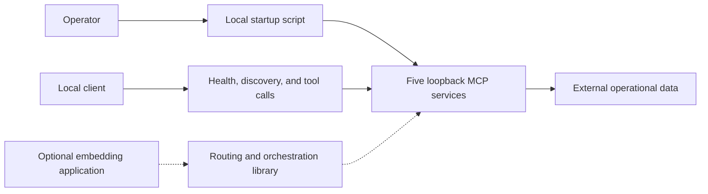

# OVCA Core

OVCA Core is an open-source, local multi-agent runtime for Coordinator, Engineer,
Reviewer, and Auditor. It combines a Rust MCP runtime with portable Policy Tools and
keeps operational data outside the source tree.

## Architecture and roster

- Coordinator: front door, synthesis, and owner decisions (`18780`)
- Engineer: engineering and automation status (`18784`)
- Reviewer: review and acceptance (`18785`)
- Auditor: cross-audit and risk review (`18786`)
- Policy Tools: twelve shared Rust/Python policy tools (`8775`)

See [architecture](docs/architecture.md), [Policy Tools authority](docs/policy-tools-authority.md),
[security boundary](docs/security-boundary.md), [dependency lock change](docs/dependency-lock-change.md),
and [limitations](docs/limitations.md).

## How it works



The startup script runs Policy Tools plus four role services. Coordinator can
classify intake, create queued task packets, and aggregate specialist status.
Engineer, Reviewer, and Auditor expose evidence-oriented tools over the shared MCP
transport. The orchestration, brain, and runtime-guard crates are reusable library
paths and are not launched automatically.

Read the [workflow-by-workflow system guide](docs/system-workflows.md) for inputs,
outputs, failure states, evidence files, and a flowchart for each workflow.

## Prerequisites

- Windows PowerShell 5.1 or PowerShell 7
- Rust 1.85 or newer with Cargo, rustfmt, and Clippy
- Python 3.11 or newer for the reference tools and tests

## Installation

```powershell
python -m venv .venv
.\.venv\Scripts\python -m pip install -r requirements-dev.txt
$env:CARGO_TARGET_DIR = 'C:\path\to\build-output'
cargo build --manifest-path rust\Cargo.toml --workspace --locked
```

## Quickstart

Choose external writable directories; startup refuses locations inside the
repository.

```powershell
.\scripts\ovca.ps1 start -DataRoot C:\ovca-data -TargetRoot C:\ovca-build -LogRoot C:\ovca-logs -PidRoot C:\ovca-pids
.\scripts\ovca.ps1 health -PidRoot C:\ovca-pids
.\scripts\ovca.ps1 stop -PidRoot C:\ovca-pids
```

The script starts only the five public services. It stores a receipt containing
PID, executable, start time, port, and service name, and will not stop a process
unless that identity still matches.

## Health and tool calls

```powershell
Invoke-RestMethod http://127.0.0.1:8775/health
Invoke-RestMethod http://127.0.0.1:18780/health
$body = Get-Content examples\policy_tool_call.json -Raw
Invoke-RestMethod http://127.0.0.1:8775/tools/call -Method Post -ContentType application/json -Body $body
```

## Tests

```powershell
cargo fmt --manifest-path rust\Cargo.toml --all -- --check
cargo check --manifest-path rust\Cargo.toml --workspace --locked
cargo test --manifest-path rust\Cargo.toml --workspace --locked
cargo clippy --manifest-path rust\Cargo.toml --workspace --all-targets --locked -- -D warnings
python -m pytest --noconftest -p no:cacheprovider -o "addopts=" scripts\tests -q
```

## Security and limitations

Services are unauthenticated development endpoints and should remain on
loopback. Configuration is placeholder-only. No credentials, private memory,
historical data, News workflow, broker integration, order routing, or capital
movement is included.

Python defines 19 pure Policy Tools. Twelve have shared Rust/Python parity;
seven cognitive tools are Python-only, advisory, and temporary until real
runtime callers and blocking tests prove stronger authority.

## Project status

OVCA Core is an early public development distribution. APIs and data contracts
may change. Legacy Aurora, Divina, and Hope enum values exist only to read old
serialized records; they are inactive, unregistered, and have no public ports.

Licensed under Apache-2.0. See [LICENSE](LICENSE) and [NOTICE](NOTICE).
