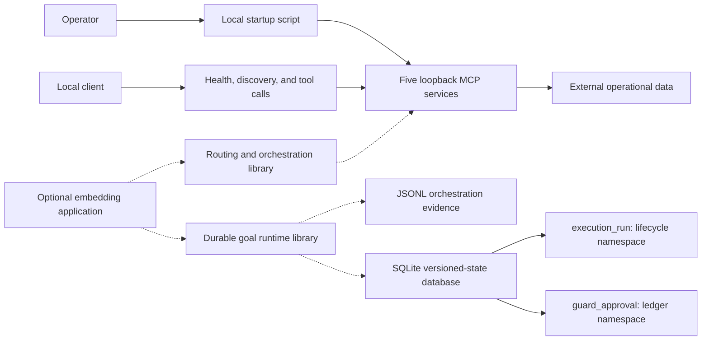

# OVCA Core

OVCA Core is an open-source, local multi-agent runtime for Coordinator, Engineer,
Reviewer, and Auditor. It combines a Rust MCP runtime with portable Policy Tools and
keeps operational data outside the source tree.

## Architecture and roster

- Coordinator: front door, synthesis, and owner decisions (`18780`)
- Engineer: engineering and automation status (`18784`)
- Reviewer: review and acceptance (`18785`)
- Auditor: cross-audit and risk review (`18786`)
- Policy Tools: twelve shared Rust/Python policy tools (`8775`)

See [architecture](docs/architecture.md), the [goal runtime contract](docs/goal-runtime-contract.md),
the [durable orchestration runtime](docs/orchestration-runtime.md),
[goal runtime observability and evaluations](docs/observability-evals.md),
[Policy Tools authority](docs/policy-tools-authority.md), [security boundary](docs/security-boundary.md),
[dependency lock change](docs/dependency-lock-change.md), and [limitations](docs/limitations.md).

## How it works


```mermaid
flowchart LR
    Operator["Operator"] --> Startup["Local startup script"]
    Startup --> Services["Five loopback MCP services"]
    Client["Local client"] --> Tools["Health, discovery, and tool calls"]
    Tools --> Services
    Services --> Data["External operational data"]
    App["Optional embedding application"] -.-> Graph["Routing and orchestration library"]
    App -.-> GoalRuntime["Durable goal runtime library"]
    Graph -.-> Services
    GoalRuntime -.-> RunLog["JSONL orchestration evidence"]
    GoalRuntime -.-> StateDb["SQLite versioned-state database"]
    StateDb --> ExecutionNs["execution_run: lifecycle namespace"]
    StateDb --> ApprovalNs["guard_approval: ledger namespace"]
```

The startup script runs Policy Tools plus four role services. Coordinator can
classify intake, create queued task packets, and aggregate specialist status.
Engineer, Reviewer, and Auditor expose evidence-oriented tools over the shared MCP
transport. The orchestration, brain, and runtime-guard crates are reusable library
paths and are not launched automatically.

The provider-independent goal runtime is also a library path. It validates
versioned goal and task contracts, creates deterministic sequential or parallel
plans, persists linked run events under a caller-supplied external root, and
replays them into a `RunRecord`. An explicit, idempotent P2 bootstrap validates
that planned JSONL state before initializing SQLite execution leases and write
ownership. P3 adds deterministic input, output, and tool guards plus a durable
pause/decision/resume boundary for sensitive R2 operations; R3 is denied by
default. An additive runtime method associates the actual P3 result with an
explicit run by appending a redacted, closed-policy JSONL projection. P4 records
caller-supplied, role-bound Reviewer and Auditor decisions
with evidence references as replayable events. A transition to `completed` is
accepted only when the risk-selected decisions validate and resolve as `Pass`;
missing, failed, or disagreeing decisions remain non-terminal. Orchestration,
execution lifecycle, and approval are three logical
authorities over two durable media: JSONL and one shared SQLite versioned-state
database. Execution and approval use separate entity namespaces in that database.
The APIs expose no combined execution-plus-approval transaction, and JSONL and
SQLite have no cross-medium transaction, outbox, or reconciliation. Coordinator
is the only role allowed to record the final response.

P5 adds a provider-independent canonical trace and deterministic completeness,
durable-reload parity, and contract-outcome graders. The read-only
`DurableGoalRuntime::evaluate_run` API loads JSONL twice and does not append
events or open SQLite. Recorded P3 pauses and policy denials survive reload and
cannot grade as successful completion. Its `0.99` completeness threshold is
enforced by a 41-case regression fixture; it is not a production telemetry SLO.

Read the [workflow-by-workflow system guide](docs/system-workflows.md) for inputs,
outputs, failure states, evidence files, and a flowchart for each workflow.

## Prerequisites

- Windows PowerShell 5.1 or PowerShell 7
- Rust 1.85 or newer with Cargo, rustfmt, and Clippy
- Python 3.11 or newer for the reference tools and tests

## Installation

```powershell
python -m venv .venv
.\.venv\Scripts\python -m pip install -r requirements-dev.txt
$env:CARGO_TARGET_DIR = 'C:\path\to\build-output'
cargo build --manifest-path rust\Cargo.toml --workspace --locked
```

## Quickstart

Choose external writable directories; startup refuses locations inside the
repository.

```powershell
.\scripts\ovca.ps1 start -DataRoot C:\ovca-data -TargetRoot C:\ovca-build -LogRoot C:\ovca-logs -PidRoot C:\ovca-pids
.\scripts\ovca.ps1 health -PidRoot C:\ovca-pids
.\scripts\ovca.ps1 stop -PidRoot C:\ovca-pids
```

The script starts only the five public services. It stores a receipt containing
PID, executable, start time, port, and service name, and will not stop a process
unless that identity still matches.

## Health and tool calls

```powershell
Invoke-RestMethod http://127.0.0.1:8775/health
Invoke-RestMethod http://127.0.0.1:18780/health
$body = Get-Content examples\policy_tool_call.json -Raw
Invoke-RestMethod http://127.0.0.1:8775/tools/call -Method Post -ContentType application/json -Body $body
```

## Tests

```powershell
cargo fmt --manifest-path rust\Cargo.toml --all -- --check
cargo check --manifest-path rust\Cargo.toml --workspace --locked
cargo test --manifest-path rust\Cargo.toml --workspace --locked
cargo clippy --manifest-path rust\Cargo.toml --workspace --all-targets --locked -- -D warnings
python -m pytest --noconftest -p no:cacheprovider -o "addopts=" scripts\tests -q
```

## Security and limitations

Services are unauthenticated development endpoints and should remain on
loopback. Configuration is placeholder-only. No credentials, private memory,
historical data, News workflow, broker integration, order routing, or capital
movement is included.

Python defines 19 pure Policy Tools. Twelve have shared Rust/Python parity;
seven cognitive tools are Python-only, advisory, and temporary until real
runtime callers and blocking tests prove stronger authority.

## Project status

OVCA Core is an early public development distribution. APIs and data contracts
may change. Legacy enum values exist only to read old serialized records; they
are inactive, unregistered, and have no public ports.

The provider-independent goal runtime version 1 contracts are
`contract_available` in `ovca-types` and `runtime_wired` through library-only
paths in `ovca-storage`, `ovca-runtime-core`, and `ovca-langgraph`. JSONL is the
P1 orchestration and replay-evidence authority. SQLite is the P2 execution lease,
retry, cancellation, idempotency, and write-ownership authority. The runtime is
not startup-wired or HTTP-exposed, and it does not invoke live workers or a
provider. The P3 approval ledger is a third logical authority. It uses the
`guard_approval:` namespace in the same SQLite versioned-state database as the P2
`execution_run:` lifecycle namespace. Current APIs expose no combined
execution-plus-approval transaction. R2 owner approval is consumed before the
effect closure. P3 returns Reviewer and Auditor requirements but does not create
their decisions. P4 independently records and replays the required decisions
with the evidence catalog before it accepts `completed`; a missing decision or a
Reviewer/Auditor disagreement blocks completion, while R0/no-review runs remain
compatible. An `ExplicitOwner` value is a typed caller assertion, not
authentication or identity proof. Explicit review and audit flags select whether
valid completion evidence is accepted from `running`, `reviewing`, or `auditing`;
approval alone does not select those gates. This remains a library-only path: it
does not invoke a live reviewer, auditor, worker, or provider.
The canonical P5 trace omits free-form payloads and metadata, uses trace-local
opaque aliases, and reports only event-backed typed facts. It includes the
redacted P3 run projection but never the exact SQLite guard request or approval
record. P2 execution remains separate. Identifier-free evidence reducers also
expose actual typed P2 durable state and direct P3 allow/pause/deny results.
P3 authority persistence and JSONL projection append have no cross-medium
transaction, outbox, or reconciliation guarantee.

Licensed under Apache-2.0. See [LICENSE](LICENSE) and [NOTICE](NOTICE).
