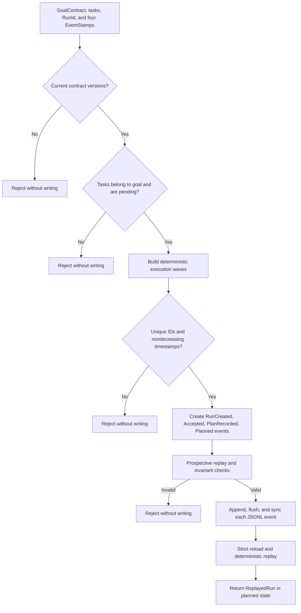
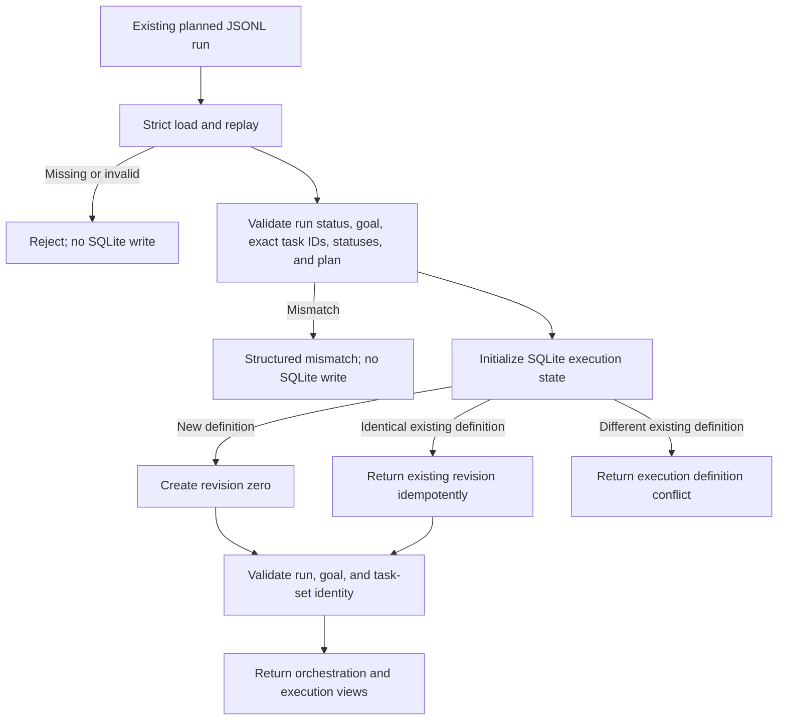
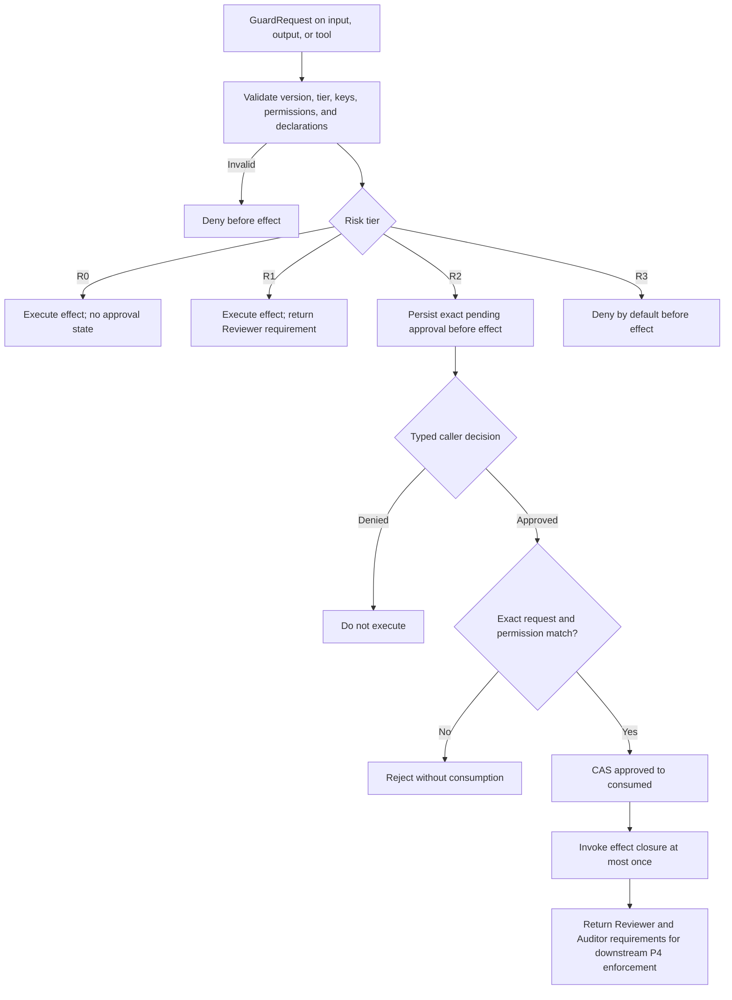
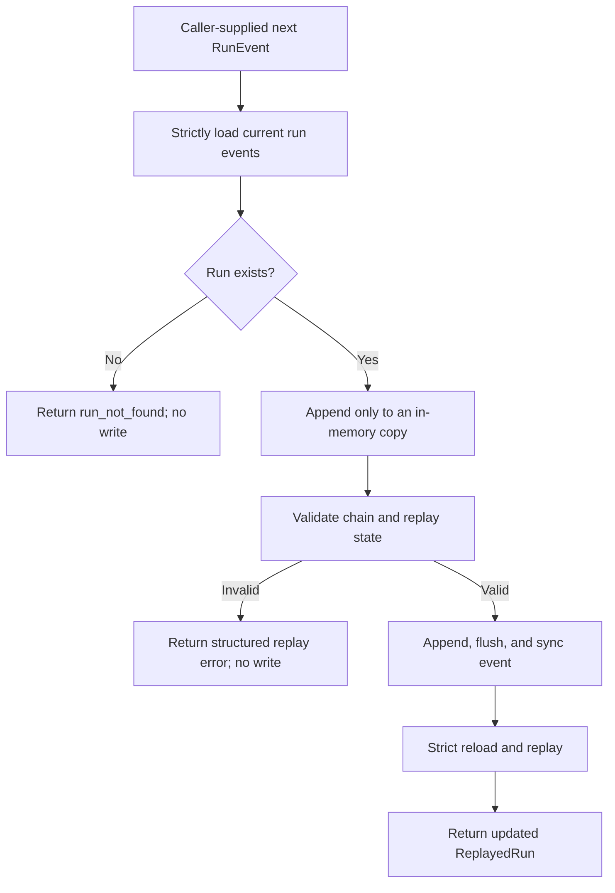

# Durable Orchestration Runtime

## Status

| Surface | Status | Meaning |
|---|---|---|
| Goal contracts and transition validator | `contract_available` | Versioned provider-independent data and pure validation |
| Scheduler, event log, replay, and durable kernel | `runtime_wired`, `library-only` | An embedding caller can create and extend a durable run |
| Startup and HTTP | not wired | `scripts/ovca.ps1` does not launch or expose this kernel |
| Worker lifecycle | `runtime_wired`, `library-only` | P2 SQLite authority owns claim, lease, heartbeat, retry, cancellation, idempotency, and write ownership |
| Guard and approval lifecycle | `runtime_wired`, `library-only` | P3 evaluates R0-R3 and durably pauses, decides, and consumes exact R2 requests |

P1 turns the P0 contracts into deterministic orchestration and replay. P2 adds a
durable execution authority without adding a provider, network call, or live
worker invocation. P3 adds a third logical authority for guarded effect closures;
it shares the SQLite versioned-state database with execution lifecycle state and
does not add live HTTP, provider, service, authentication, or credential wiring.

## Bootstrap workflow

`build_planned_run` and `DurableGoalRuntime::create_run` accept a goal, tasks,
run ID, and four caller-supplied event IDs and timestamps.

The scheduler orders ready tasks by task ID. Tasks share a parallel wave only
when dependencies are satisfied before that wave and their declared `write_keys`
are disjoint. A parallel wave is a plan, not evidence that workers ran.

## P2 execution bootstrap workflow

`DurableGoalRuntime::new` constructs orchestration, execution, and approval
authority handles without touching either durable medium. `create_run` remains a
JSONL-only operation. The caller must explicitly bridge JSONL orchestration to
the SQLite execution namespace with `initialize_execution`.

The order is durable JSONL validation first, SQLite initialization second. There
is no cross-medium transaction. If a process stops after `create_run`, the absent
SQLite execution entity is an explicit bootstrap gap. Retrying
`initialize_execution` with identical tasks and retry budget recovers it.
Retrying after the entity already exists is idempotent; a changed definition
fails instead of replacing state.

## P3 guard, pause, and resume workflow

`DurableGoalRuntime` owns a `DurableGuardrailAuthority` rooted at the same
caller-supplied external root. Construction remains filesystem-side-effect free.
Execution records use the `execution_run:` entity namespace and approval records
use `guard_approval:` in the same SQLite versioned-state database. The runtime
exposes typed evaluation/record, guarded execution, owner decision, strict
approval load, and exact approved-resume methods. Those APIs expose no combined
execution-plus-approval transaction.

R2 covers repository writes, network actions, publication, and external side
effects on every guard surface. All pause before the effect closure. R3 covers
destructive, secret-bearing, irreversible, and privileged effects and is denied
by default. `ApprovalAuthority::ExplicitOwner` is a typed caller assertion, not
authentication, tenancy, credential, session, or identity proof.

Consumption occurs before the effect closure. Approval consumption and an
external side effect are not one transaction. Failure or panic after consumption
can leave no external effect while still enforcing at-most-once/no-retry. P3
returns Reviewer and Auditor requirements but does not satisfy their evidence
decisions; that completion enforcement belongs to P4.

## Authority matrix

| Concern | Logical authority | Durable medium / namespace |
|---|---|---|
| Run events, orchestration status, declared task IDs, plan, evidence, and replay | P1 orchestration | JSONL event log |
| Claims, leases, heartbeats, attempts, terminal idempotency, CAS revision, and write owners | P2 execution lifecycle | Shared SQLite database, `execution_run:` entities |
| Exact guard request, caller decision, approval state, and consumption | P3 approval ledger | Shared SQLite database, `guard_approval:` entities |
| Shared run, goal, and exact task-set identity | Combined runtime-view validation | Reads JSONL orchestration and SQLite execution entities |
| Task status after bootstrap | Orchestration and execution authorities expose it separately | Equality is not required |

For example, a durable SQLite claim changes its task snapshot to `running` while
JSONL remains `pending` until a caller explicitly appends a valid orchestration
event. Approval state also changes independently in its SQLite entity namespace.
Current APIs expose no combined execution-plus-approval transaction. JSONL and
SQLite have no cross-medium transaction, outbox, projection, reconciliation, or
fabricated atomicity.

## Append workflow

An embedding caller supplies a complete next `RunEvent`. The kernel never reads
a clock or generates an ID.

## Replay invariants

- The stream is non-empty and starts with exactly one `RunCreated` event in
  `draft`.
- Every event uses the current contract version, the same run ID, a contiguous
  zero-based sequence, an exact previous-event link, and a unique event ID.
- A recorded plan covers every declared task exactly once with contiguous wave
  indexes.
- Status transitions start from the replayed status and pass the P0 transition
  validator.
- Completion evidence uses current contracts and references evidence attached
  earlier in the event stream.
- Specialist output belongs to a declared task, uses Engineer, Reviewer, or
  Auditor, and matches the event producer role.
- Only Coordinator may record `CoordinatorFinalResponseRecorded`, and it may
  appear once.

## Storage boundary

`RunEventLog` writes `run-events/events.jsonl` below a caller-supplied external
root. It never treats `RunId` as a path component. Missing logs are empty;
malformed non-empty rows are errors with line context. Every successful append
flushes and calls `sync_all` before returning.

The log is strict across the file. A malformed row for any run prevents a clean
load until the external data is repaired. The repository itself receives no run
data when the caller supplies an external root.

## Role ownership

- Coordinator creates the bootstrap events and owns the final response.
- Engineer, Reviewer, and Auditor may record bounded specialist outputs for
  declared tasks.
- P1 records and replays outputs; it does not invoke or supervise those roles.

## Current API map

| API | Crate | Responsibility |
|---|---|---|
| `schedule_tasks` | `ovca-runtime-core` | Deterministic dependency and write-key planning |
| `RunEventLog` | `ovca-storage` | Strict durable JSONL append and load |
| `validate_event_chain` | `ovca-runtime-core` | Structural event-chain integrity |
| `replay_run` | `ovca-runtime-core` | Deterministic state reconstruction |
| `build_planned_run` | `ovca-langgraph` | Pure four-event bootstrap construction |
| `DurableGoalRuntime` | `ovca-langgraph` | Validate-before-append and strict reload/replay |
| `DurableExecutionAuthority` | `ovca-runtime-core` | Transactional SQLite execution lease and write ownership |
| `DurableGuardrailAuthority` | `ovca-runtime-core` | Durable exact R2 pause, decision, strict load, and at-most-once consumption |
| `initialize_execution` | `ovca-langgraph` | Validate JSONL first, then idempotently bootstrap SQLite |
| `load_runtime_view` | `ovca-langgraph` | Return both authorities after identity/task-set checks |
| `execute_guarded` / `resume_approved` | `ovca-langgraph` | Preserve typed guard execution and approval errors at the runtime boundary |

## Runtime limitations

- One JSONL writer per run remains a caller obligation. SQLite commands serialize
  through their own transactional authority.
- Bootstrap writes four synced JSONL lines sequentially. A storage failure can
  leave a replayable partial bootstrap, and automatic recovery is not present.
- The kernel plans parallel waves but does not execute them.
- Current APIs expose no combined execution-plus-approval transaction in the
  shared SQLite database. JSONL and SQLite have no cross-medium transaction,
  lifecycle projection, outbox, or reconciliation.
- Combined two-medium behavior has no cross-process integration test yet.
- No live worker or provider path validates execution against external effects.
- P3 interrupts R2 closures in the library, but no live Reviewer action, live
  Auditor action, provider call, credential, server endpoint, or remote side
  effect is included.
- Approval consumption precedes the effect and is not atomic with it. A failure
  or panic can consume approval without producing an external effect.

## Verification map

| Concern | Evidence |
|---|---|
| Contract and state transitions | `rust/ovca-types/src/goal_runtime.rs` tests |
| Deterministic scheduling and Coordinator finalization | `rust/ovca-runtime-core/src/scheduler.rs`, `finalization.rs` tests |
| Event integrity and replay | `rust/ovca-runtime-core/src/replay.rs` tests |
| Strict durable bytes and path safety | `rust/ovca-storage/src/run_events.rs` tests |
| Bootstrap and validate-before-append behavior | `rust/ovca-langgraph/src/goal_runtime.rs` tests |
| Two-store bootstrap, recovery, combined views, and authority divergence | `rust/ovca-langgraph/src/goal_runtime.rs` tests |
| R0/R2/R3 guarded execution, reopen, mismatch, concurrent resume, and logical-authority independence | `rust/ovca-langgraph/src/goal_runtime.rs` tests |

All run IDs, event IDs, worker IDs, lease IDs, idempotency keys, and timestamps
are caller supplied. The runtime generates no implicit clock or identity values.
The supported public roles are exactly Coordinator, Engineer, Reviewer, and
Auditor. The core path has no provider dependency.
