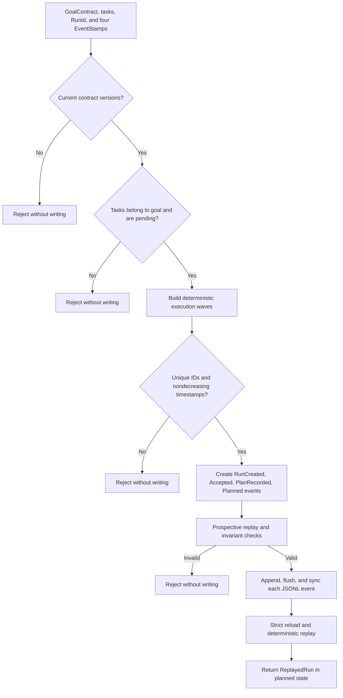
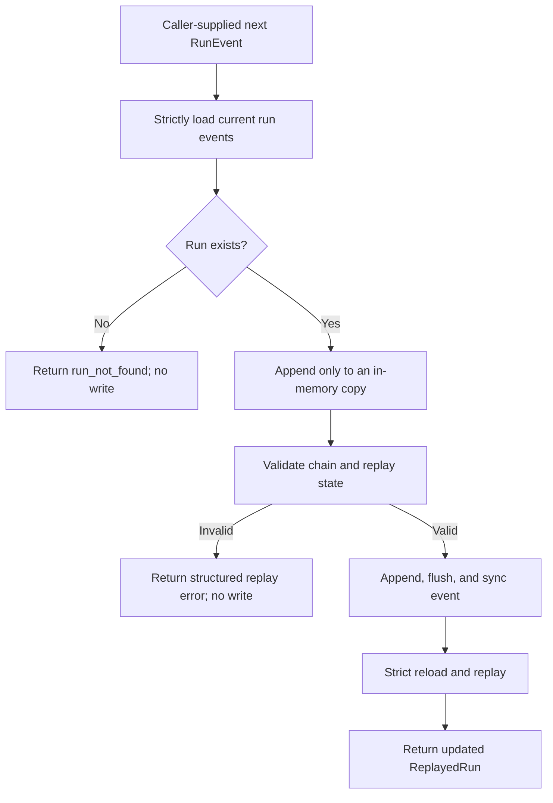

# Durable Orchestration Runtime

## Status

| Surface | Status | Meaning |
|---|---|---|
| Goal contracts and transition validator | `contract_available` | Versioned provider-independent data and pure validation |
| Scheduler, event log, replay, and durable kernel | `runtime_wired`, `library-only` | An embedding caller can create and extend a durable run |
| Startup and HTTP | not wired | `scripts/ovca.ps1` does not launch or expose this kernel |
| Worker lifecycle | not implemented in P1 | P2 owns claim, lease, heartbeat, retry, cancellation, and write ownership |

P1 turns the P0 contracts into a deterministic library workflow. It does not
turn planning into worker execution and does not add a provider or network call.

## Bootstrap workflow

`build_planned_run` and `DurableGoalRuntime::create_run` accept a goal, tasks,
run ID, and four caller-supplied event IDs and timestamps.

The scheduler orders ready tasks by task ID. Tasks share a parallel wave only
when dependencies are satisfied before that wave and their declared `write_keys`
are disjoint. A parallel wave is a plan, not evidence that workers ran.

## Append workflow

An embedding caller supplies a complete next `RunEvent`. The kernel never reads
a clock or generates an ID.

## Replay invariants

- The stream is non-empty and starts with exactly one `RunCreated` event in
  `draft`.
- Every event uses the current contract version, the same run ID, a contiguous
  zero-based sequence, an exact previous-event link, and a unique event ID.
- A recorded plan covers every declared task exactly once with contiguous wave
  indexes.
- Status transitions start from the replayed status and pass the P0 transition
  validator.
- Completion evidence uses current contracts and references evidence attached
  earlier in the event stream.
- Specialist output belongs to a declared task, uses Engineer, Reviewer, or
  Auditor, and matches the event producer role.
- Only Coordinator may record `CoordinatorFinalResponseRecorded`, and it may
  appear once.

## Storage boundary

`RunEventLog` writes `run-events/events.jsonl` below a caller-supplied external
root. It never treats `RunId` as a path component. Missing logs are empty;
malformed non-empty rows are errors with line context. Every successful append
flushes and calls `sync_all` before returning.

The log is strict across the file. A malformed row for any run prevents a clean
load until the external data is repaired. The repository itself receives no run
data when the caller supplies an external root.

## Role ownership

- Coordinator creates the bootstrap events and owns the final response.
- Engineer, Reviewer, and Auditor may record bounded specialist outputs for
  declared tasks.
- P1 records and replays outputs; it does not invoke or supervise those roles.

## Current API map

| API | Crate | Responsibility |
|---|---|---|
| `schedule_tasks` | `ovca-runtime-core` | Deterministic dependency and write-key planning |
| `RunEventLog` | `ovca-storage` | Strict durable JSONL append and load |
| `validate_event_chain` | `ovca-runtime-core` | Structural event-chain integrity |
| `replay_run` | `ovca-runtime-core` | Deterministic state reconstruction |
| `build_planned_run` | `ovca-langgraph` | Pure four-event bootstrap construction |
| `DurableGoalRuntime` | `ovca-langgraph` | Validate-before-append and strict reload/replay |

## P1 limitations

- One writer per run is a caller obligation. There is no claim, lease,
  compare-and-swap, heartbeat, retry budget, cancellation, or write-owner lock.
- Bootstrap writes four synced JSONL lines sequentially. A storage failure can
  leave a replayable partial bootstrap, and automatic recovery is not present.
- The kernel plans parallel waves but does not execute them.
- No approval interruption, live Reviewer action, live Auditor action, provider
  call, credential, server endpoint, or remote side effect is included.

## Verification map

| Concern | Evidence |
|---|---|
| Contract and state transitions | `rust/ovca-types/src/goal_runtime.rs` tests |
| Deterministic scheduling and Coordinator finalization | `rust/ovca-runtime-core/src/scheduler.rs`, `finalization.rs` tests |
| Event integrity and replay | `rust/ovca-runtime-core/src/replay.rs` tests |
| Strict durable bytes and path safety | `rust/ovca-storage/src/run_events.rs` tests |
| Bootstrap and validate-before-append behavior | `rust/ovca-langgraph/src/goal_runtime.rs` tests |
