# OVCA Core System Workflows

This document explains how OVCA Core works one workflow at a time. It separates
what the startup script runs today from reusable library paths that an embedding
application may call.

## 1. System purpose

OVCA Core is a local, role-based multi-agent runtime. It exposes five loopback
HTTP services:

| Service | Port | Responsibility |
|---|---:|---|
| Policy Tools | `8775` | Return structured policy and decision checks |
| Coordinator | `18780` | Classify intake, create queue packets, aggregate status, and surface decisions |
| Engineer | `18784` | Read automation, operational health, and incident evidence |
| Reviewer | `18785` | Read the newest review evidence from task artifacts |
| Auditor | `18786` | Read the newest cross-audit evidence from task artifacts |

Operational data is not stored in the repository. The operator supplies external
data, build, log, and PID roots when starting the system.

### Non-goals

- OVCA Core is not a hosted or production-hardened service.
- It does not include authentication, tenancy, encrypted storage, private memory,
  or historical operational data.
- A routing decision does not automatically spawn a worker or execute a task.
- Reviewer and Auditor status tools read existing evidence; they do not perform a
  new review or audit by themselves.
- Policy Tool output is structured guidance unless a real caller enforces it as a
  gate.

## 2. Runtime status legend

| Status | Meaning |
|---|---|
| `startup-wired` | `scripts/ovca.ps1 start` builds and launches it |
| `HTTP-exposed` | A running service exposes the workflow through HTTP |
| `library-only` | Source and tests exist, but the startup script does not launch it |
| `compatibility-only` | Kept for embedding, parity, or old serialized data, not as an active public worker |

## 3. Whole-system view

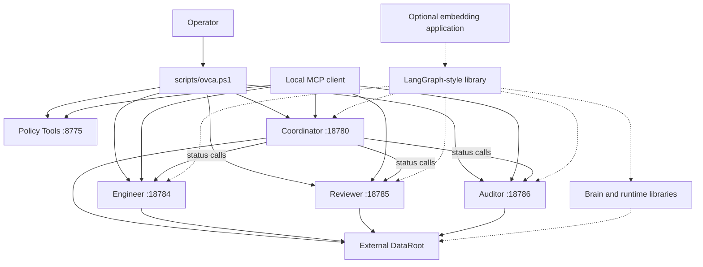

The solid lines are the public startup and HTTP surfaces. Dashed lines are
library-level integration paths that require an embedding caller.

## 4. Workflow index

| Workflow | Runtime status | Primary result |
|---|---|---|
| 1. Start the local runtime | `startup-wired` | Five owned local processes |
| 2. Discover and call an MCP tool | `HTTP-exposed` | Normalized JSON response |
| 3. Classify intake and choose a role | `HTTP-exposed` | Route decision, not execution |
| 4. Create a dispatch packet | `HTTP-exposed` | Queued JSONL task packet |
| 5. Read Engineer operational status | `HTTP-exposed` | Health, worker, and incident view |
| 6. Read Reviewer evidence | `HTTP-exposed` | Latest review status and history |
| 7. Read Auditor evidence | `HTTP-exposed` | Latest cross-audit status and risks |
| 8. Aggregate team status | `HTTP-exposed` | Combined status with offline detection |
| 9. Run a Policy Tool | `startup-wired`, `HTTP-exposed` | Structured policy result |
| 10. Run the orchestration loop | `library-only` | Graded and synthesized response |
| 11. Record runtime evidence and use brain context | `library-only` | JSONL events, snapshot, and retrieval context |
| 12. Check health and stop owned processes | `startup-wired` | Health table or identity-safe shutdown |

## 5. Workflow 1: Start the local runtime

**Status:** `startup-wired`

**What it does:** Resolves external directories, confirms all required ports are
free, builds five Rust packages with the lockfile, starts each executable, and
writes one process receipt per service.

**Why it exists:** The runtime needs a repeatable local startup path that keeps
writable data outside the source tree and can later prove which processes it owns.

**Inputs:** `DataRoot`, `TargetRoot`, `LogRoot`, and `PidRoot` outside the
repository.

**Output:** Five loopback listeners plus receipts containing service, port, PID,
executable path, and process start time.

**What happens next:** A client can call `/health`, `/tools/list`, and
`/tools/call` on each service.

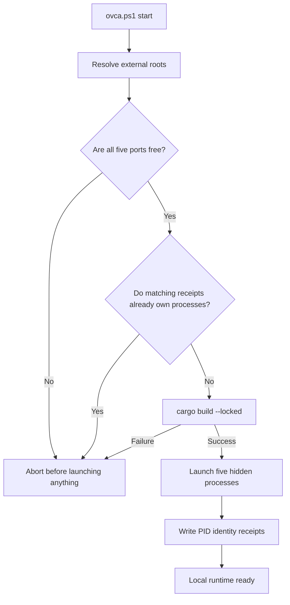

**Failure states:** Missing roots, roots inside the repository, occupied ports,
an existing owned process, a failed Cargo build, or a missing executable stop the
workflow. A partial launch is rolled back using only processes started by the same
invocation.

**Evidence:** `scripts/ovca.ps1`, `scripts/tests/test_ovca_startup_script.py`

## 6. Workflow 2: Discover and call an MCP tool

**Status:** `HTTP-exposed`

**What it does:** Every role server uses the shared `ovca-mcp` router. A client
can inspect health and tool schemas, then submit a named tool call with JSON
arguments.

**Why it exists:** All services share one small and predictable transport
contract instead of inventing a different API per role.

**Inputs:** A tool name and JSON `arguments` object.

**Output:** A normalized envelope with `ok`, result or error data, and trace/error
fields.

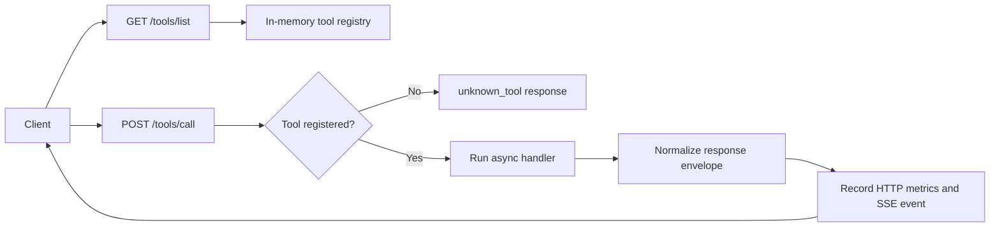

**Common endpoints:** `/health`, `/metrics`, `/registry`, `/tools/list`,
`/tools/call`, `/resources/list`, `/resources/get`, `/prompts/list`,
`/prompts/get`, and `/sse`.

**Failure states:** Unknown tools return a structured error. A service that is not
listening is reported by the HTTP client as an offline MCP rather than silently
rerouting to another role.

**Evidence:** `rust/ovca-mcp/src/server.rs`,
`rust/ovca-llm-client/src/mcp_client.rs`

## 7. Workflow 3: Classify intake and choose a role

**Status:** `HTTP-exposed`

**Tool:** `coordinator_route_intake`

**What it does:** Validates `user_text`, honors an explicit active-role request,
or classifies the text into an intent and maps it to a role.

**Why it exists:** The front door needs a deterministic routing explanation before
any downstream caller decides whether to invoke a specialist.

**Inputs:** Required `user_text` and optional `requested_agent`.

**Output:** `intent`, `route_target`, `reason`, and a divergence-policy hint.

| Intent | Default route |
|---|---|
| `intel` | Reviewer |
| `research` | Auditor |
| `trading` | Coordinator |
| `engineering` | Engineer |
| `general` | Coordinator |

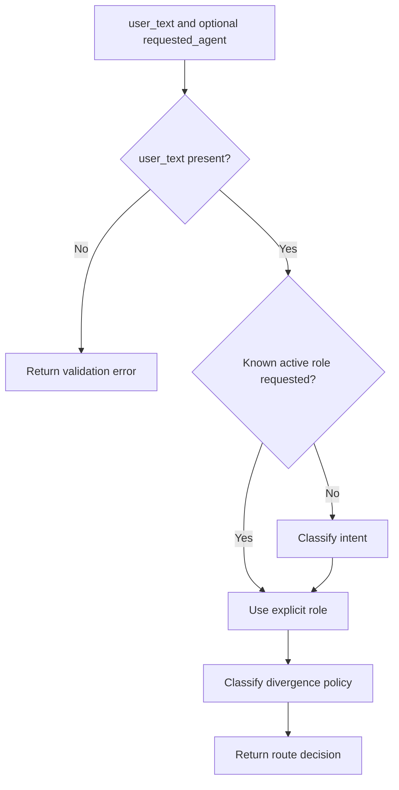

**What happens next:** The tool stops at a route decision. A client, such as an
embedding application using `ovca-langgraph`, must make the specialist call.

**Failure states:** Empty text returns an error. Unknown or inactive requested
identities are ignored and never become a route target.

**Evidence:** `rust/ovca-coordinator-server/src/main.rs`,
`rust/ovca-runtime-core/src/lib.rs`, `rust/ovca-types/src/lib.rs`

## 8. Workflow 4: Create a dispatch packet

**Status:** `HTTP-exposed`

**Tool:** `coordinator_dispatch`

**What it does:** Validates a specialist role and objective, creates a tracking
ID, and appends a queued packet to an external JSONL dispatch queue.

**Why it exists:** Routing intent and durable work handoff are separate concerns.
The queue packet provides a small audit trail without pretending that work has
already run.

**Inputs:** `agent`, `objective`, and optional `deadline`.

**Output:** A packet containing `tracking_id`, `created_at`, `agent`, `objective`,
`deadline`, `status: queued`, and `source: coordinator_mcp`.

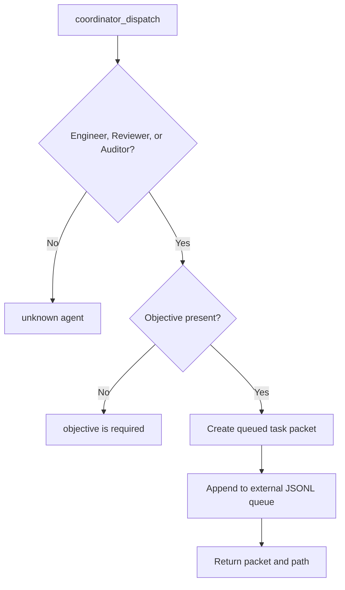

**What happens next:** An external dispatcher or operator must consume the queue.
This repository does not start a worker from this tool.

**Failure states:** Unsupported roles, empty objectives, or a queue write failure
return an error and do not claim execution.

**Evidence:** `rust/ovca-coordinator-server/src/main.rs`

## 9. Workflow 5: Read Engineer operational status

**Status:** `HTTP-exposed`

**Tools:** `engineer_automation_status`, `engineer_ops_health`,
`engineer_incident_log`, and `engineer_spec_request_draft`.

**What it does:** Reads worker state and an external health manifest, evaluates
configured timestamp/file checks, returns recent warning or failure history, and
can produce a plain-text engineering spec draft.

**Why it exists:** Engineering decisions need current operational evidence and a
consistent way to frame implementation inputs, outputs, constraints, and rollback.

**Inputs:** External state/log files and optional history limits or dates.

**Output:** `ok`, `warn`, `fail`, or `unknown` summaries, worker rows, job details,
incident items, or a spec draft.

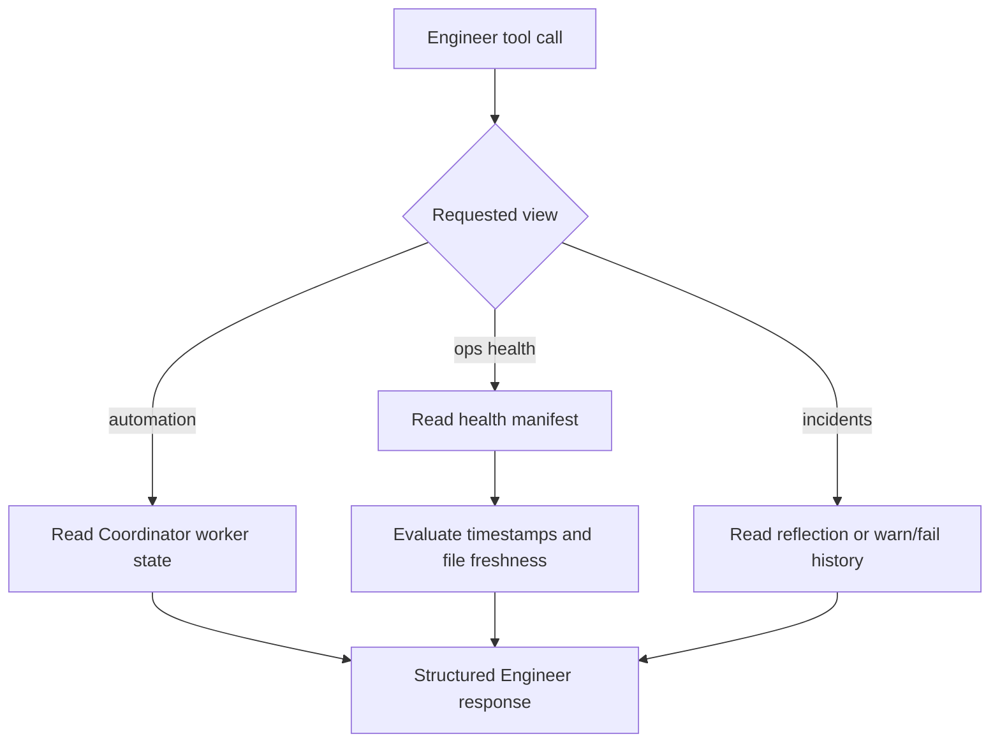

**What happens next:** Coordinator can consume `engineer_ops_health` during team
aggregation. The optional `--ops-health-check` CLI mode can write a latest snapshot
and history row; normal HTTP reads do not create those artifacts.

**Failure states:** Missing or malformed manifests become explicit fail/unknown
results. Strict CLI mode returns a non-zero exit code only for a failing result.

**Evidence:** `rust/ovca-engineer-server/src/main.rs`,
`rust/ovca-engineer-server/src/ops_health.rs`

## 10. Workflow 6: Read Reviewer evidence

**Status:** `HTTP-exposed`

**Tool:** `reviewer_review_status`

**What it does:** Scans external `tasks/audits`, `tasks/outbox`, and `tasks/inbox`
directories for Reviewer or end-to-end review artifacts, sorts candidates by
modification time, and reads the newest status and summary.

**Why it exists:** A caller needs a stable status view even when review evidence is
stored as task folders and Markdown/JSON files.

**Inputs:** Optional query and history limit plus the external task tree.

**Output:** Latest `overall_status`, summary, source path, findings, and bounded
artifact history.

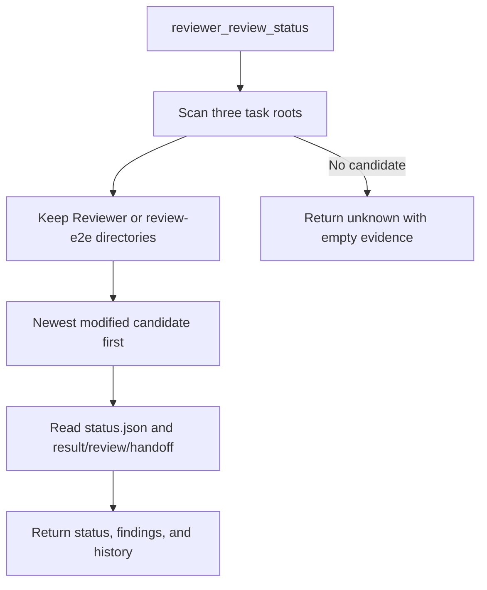

**What happens next:** Coordinator team status or the orchestration library can
summarize this evidence. The tool does not execute a review.

**Failure states:** Missing artifacts are tolerated and produce `unknown`, not a
false pass.

**Evidence:** `rust/ovca-reviewer-server/src/main.rs`

## 11. Workflow 7: Read Auditor evidence

**Status:** `HTTP-exposed`

**Tool:** `auditor_cross_audit_status`

**What it does:** Scans the same external task roots for Auditor, cross-audit, or
compliance evidence and normalizes the latest status, summary, risks, and history.

**Why it exists:** Cross-check evidence should be independently readable and must
not be inferred from the Reviewer result.

**Inputs:** Optional query and history limit plus the external task tree.

**Output:** Latest `overall_status`, risk summary, source path, and bounded artifact
history.

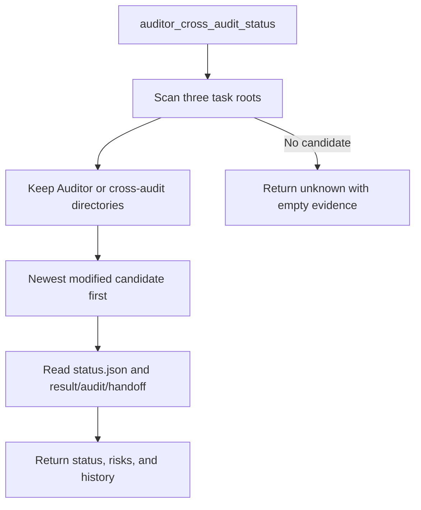

**What happens next:** Coordinator can compare Reviewer and Auditor signals or
surface a conflict requiring an owner decision. The tool does not execute an
audit.

**Failure states:** Missing artifacts produce `unknown`. Unsupported or unreadable
summary files do not become a pass.

**Evidence:** `rust/ovca-auditor-server/src/main.rs`

## 12. Workflow 8: Aggregate team status

**Status:** `HTTP-exposed`

**Tool:** `coordinator_team_status`

**What it does:** Calls Engineer, Reviewer, and Auditor concurrently, extracts each
status, records offline roles, and calculates one combined status.

**Why it exists:** Operators need a single front-door view without hiding which
specialist produced each signal.

**Inputs:** The three specialist HTTP endpoints and their external evidence roots.

**Output:** Per-role payloads plus `overall_status` and an offline-role list.

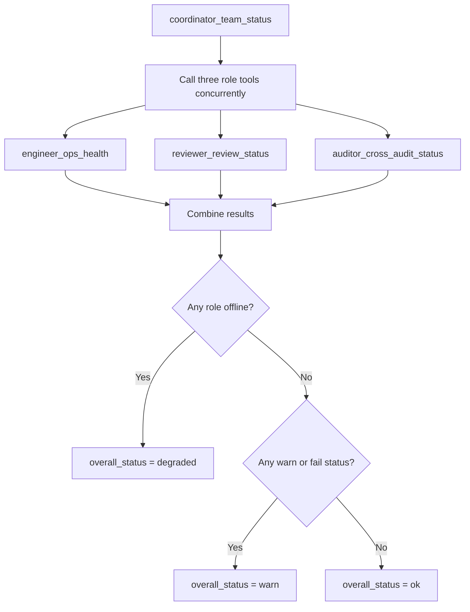

**Failure states:** One offline role does not erase the other responses. The
aggregate becomes `degraded` and identifies the unavailable role.

**Evidence:** `rust/ovca-coordinator-server/src/main.rs`,
`rust/ovca-llm-client/src/mcp_client.rs`

## 13. Workflow 9: Run a Policy Tool

**Status:** `startup-wired`, `HTTP-exposed`

**What it does:** The Rust service exposes twelve deterministic Policy Tools over
the same health/list/call pattern used by the role servers.

**Why it exists:** Callers can request structured checks for evidence, confidence,
change notices, planning, and dispatch readiness without embedding policy wording
in every application.

**HTTP tools:** `sati_check`, `temporal_gate`, `support_disclose`,
`certainty_zone`, `claim_tag`, `drift_check`, `scamper_fill`, `business_gate`,
`decision_format`, `pre_change_notice`, `plan_before_dispatch`, and
`dispatch_blocker_check`.

**Inputs:** Tool-specific JSON arguments.

**Output:** Deterministic structured guidance or a blocking result for the caller
to enforce.

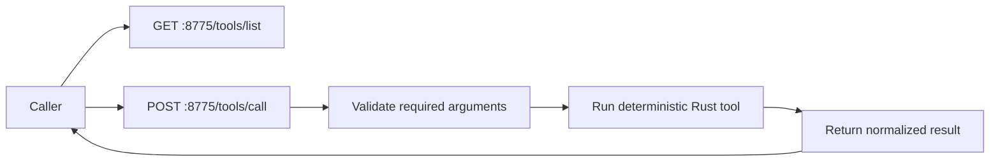

**Authority boundary:** Python also defines nineteen pure functions. Twelve have
cross-language parity with Rust. Seven cognitive helpers are Python-only,
advisory, and are not exposed by the authoritative Rust HTTP service. Tool output
becomes a hard gate only when a real caller blocks on it.

**Failure states:** Missing required arguments produce transport-level tool errors.
An advisory result must not be described as enforced without caller-level proof.

**Evidence:** `docs/policy-tools-authority.md`,
`rust/ovca-policy-tools/src/http_server.rs`,
`scripts/mcp/policy_tools_server.py`, `scripts/agent_tasks/policy_gate.py`

## 14. Workflow 10: Run the orchestration loop

**Status:** `library-only`

**What it does:** `ovca-langgraph` can intake a request, ask Coordinator for a
route, retrieve optional brain context, call one role tool, grade the response,
rewrite the query up to two times, and synthesize a Coordinator response.

**Why it exists:** An embedding application can compose routing, retrieval,
specialist evidence, and final synthesis without putting that loop inside every
HTTP server.

**Inputs:** User text, optional requested role, session ID, MCP client, and external
brain root.

**Output:** `AgentState` or detailed graph state with route, response, confidence,
and execution trace.

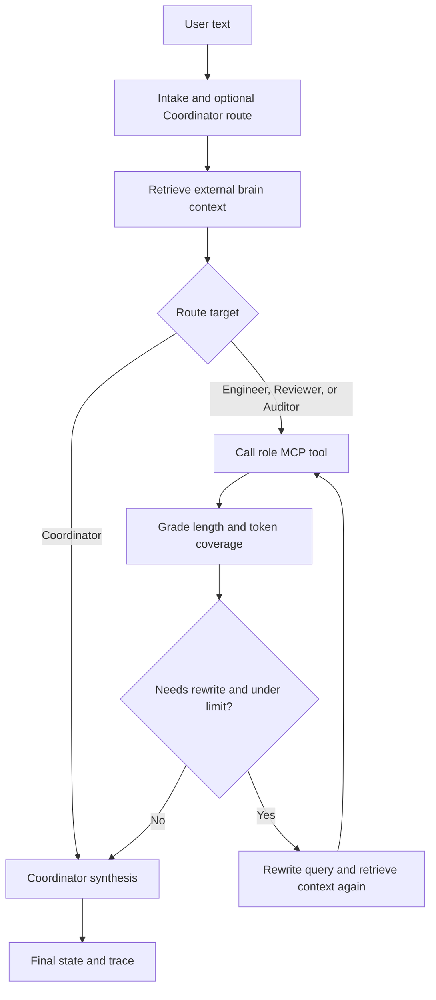

**Important limitation:** The grader is a deterministic length and token-overlap
heuristic, not an independent model judgment. `scripts/ovca.ps1` does not launch a
LangGraph service; an application must call this library explicitly.

**Failure states:** If Coordinator routing is unavailable, local classification is
used. If a specialist MCP is offline, the graph records a fallback response and
the grade/rewrite loop may retry up to the configured limit.

**Evidence:** `rust/ovca-langgraph/src/lib.rs`,
`rust/ovca-runtime-core/src/lib.rs`, `rust/ovca-brain/src/search.rs`

## 15. Workflow 11: Record runtime evidence and use brain context

**Status:** `library-only`

**What it does:** Runtime Core can append typed events to JSONL and atomically
refresh a summary snapshot. Brain and Storage libraries parse external Markdown
nodes, enforce role-based read/write permissions, cache indexes, and search for
context snippets.

**Why it exists:** Runtime evidence and retrieval context need explicit schemas and
external storage boundaries even when an embedding application chooses how to use
them.

**Inputs:** External root, runtime events, brain-node files, caller identity, and a
search query.

**Output:** `logs/runtime_guard/events.jsonl`,
`logs/runtime_guard/latest.json`, parsed brain nodes, or ranked context hits.

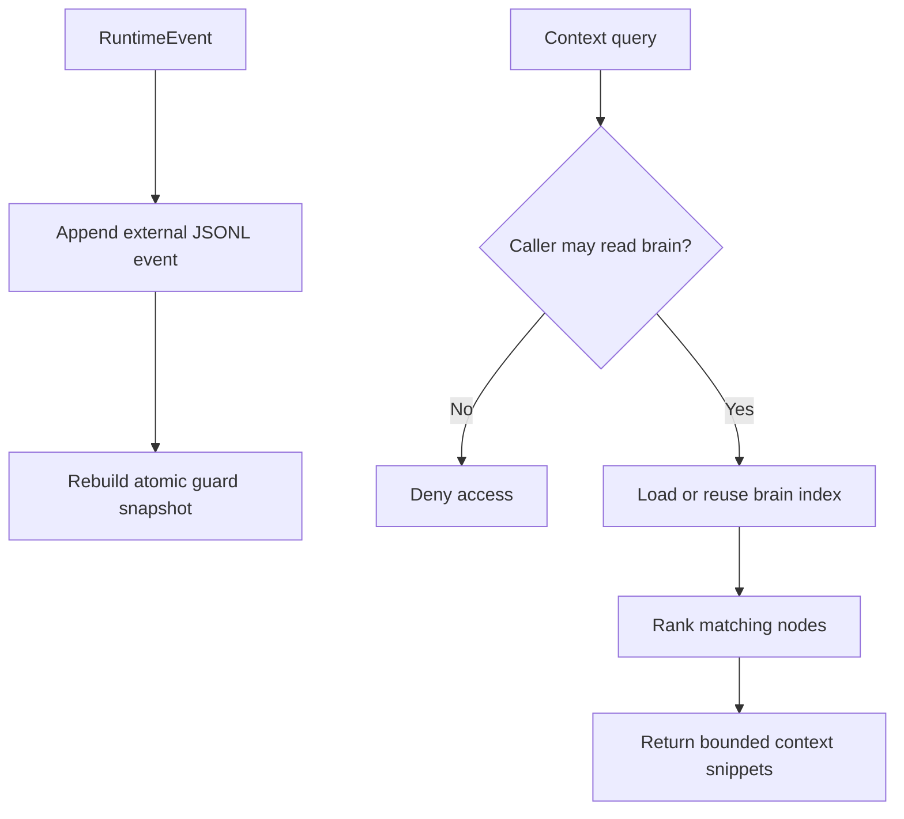

**Authority boundary:** These are reusable crates. Startup does not automatically
emit events, populate a brain, or run a background indexer.

**Failure states:** Unknown callers or brains are denied. Missing snapshots fall
back to rebuilding from the event log. Missing brain directories return no
context rather than inventing data.

**Evidence:** `rust/ovca-runtime-core/src/lib.rs`, `rust/ovca-brain/src`,
`rust/ovca-storage/src`

## 16. Workflow 12: Check health and stop owned processes

**Status:** `startup-wired`

**What it does:** `health` verifies that each receipt still identifies the same
PID, executable, and start time before calling the service `/health` endpoint.
`stop` applies the same identity check before terminating a process and deleting
its receipt.

**Why it exists:** PID reuse can make a blind stop command terminate an unrelated
process. The receipt is an ownership proof, not just a PID cache.

**Inputs:** External `PidRoot` containing startup receipts.

**Output:** One health row per service or a stopped set of owned processes.

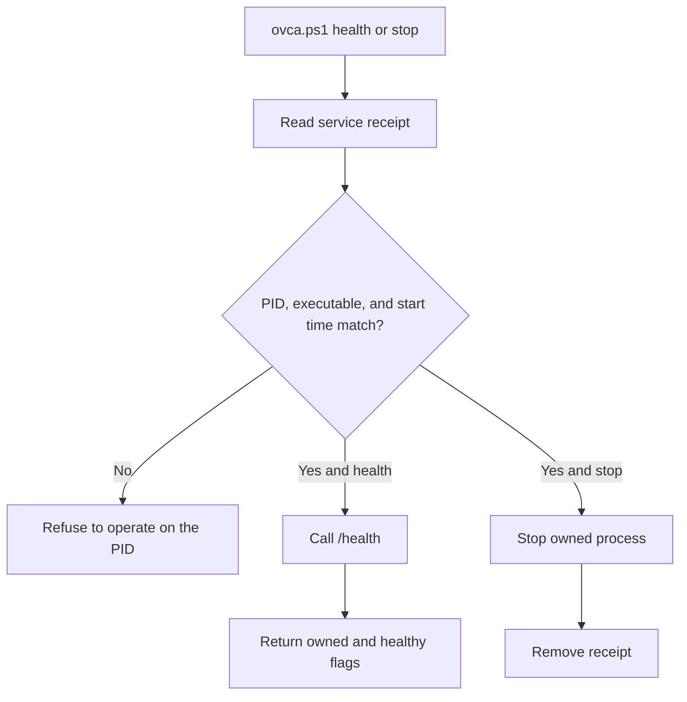

**Failure states:** A live PID with mismatched identity causes a hard refusal. A
matching process with an unhealthy HTTP endpoint remains `process_owned: true`
and `healthy: false`.

**Evidence:** `scripts/ovca.ps1`, `scripts/tests/test_ovca_startup_script.py`

## 17. What is verified, inferred, and unknown

### Observed in source and tests

- Startup launches exactly five loopback services.
- Active role ports are `18780`, `18784`, `18785`, and `18786`; Policy Tools uses
  `8775`.
- Coordinator routing accepts only public active role IDs.
- Reviewer and Auditor return `unknown` when no matching evidence exists.
- Team aggregation preserves partial responses and reports offline roles.
- The public startup does not launch the LangGraph, runtime guard, or brain
  libraries as independent services.

### Inferred integration pattern

- A host application can use `ovca-langgraph` as the control loop around the five
  HTTP services because the crate implements that sequence and its tests exercise
  it. The public repository does not include a hosted front end that invokes it.

### Unknown until deployed by an operator

- Which external dispatcher consumes queued packets.
- Which operational artifacts are present in a specific `DataRoot`.
- Whether a downstream application enforces a Policy Tool result as a hard gate.
- Which LLM or embedding provider an integrator configures.

## 18. Verification map

| Concern | Primary test surface |
|---|---|
| Startup roots, ports, receipts, rollback, and stop ownership | `scripts/tests/test_ovca_startup_script.py` |
| Public runtime and identity boundary | `scripts/tests/test_public_runtime_boundary.py` |
| Shared MCP response behavior | Rust tests in `ovca-mcp` |
| Role registration and calls | Rust tests in each role-server crate |
| Route, grade, rewrite, and fallback behavior | Rust tests in `ovca-langgraph` |
| Policy Tool behavior | Rust package tests and Python policy tests |
| Rust/Python parity | `scripts/tests/test_policy_tools_rust_parity.py` |
| Cognitive advisory helpers | `scripts/tests/test_cognitive_leadership_tools.py` |

## 19. Suggested reading order

1. `README.md`
2. This workflow guide
3. `docs/architecture.md`
4. `docs/security-boundary.md`
5. `docs/policy-tools-authority.md`
6. `docs/limitations.md`
7. The evidence files listed under the workflow you want to change
